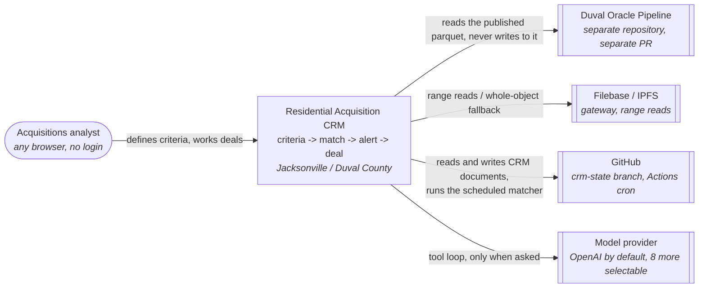
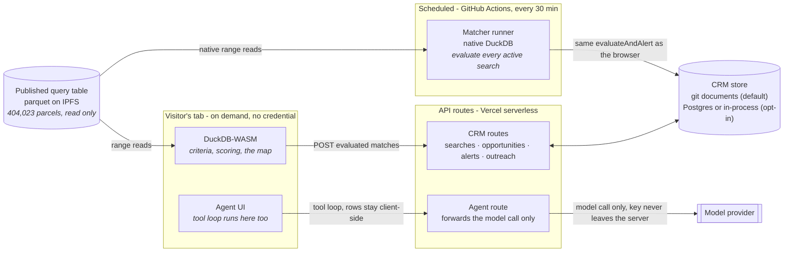
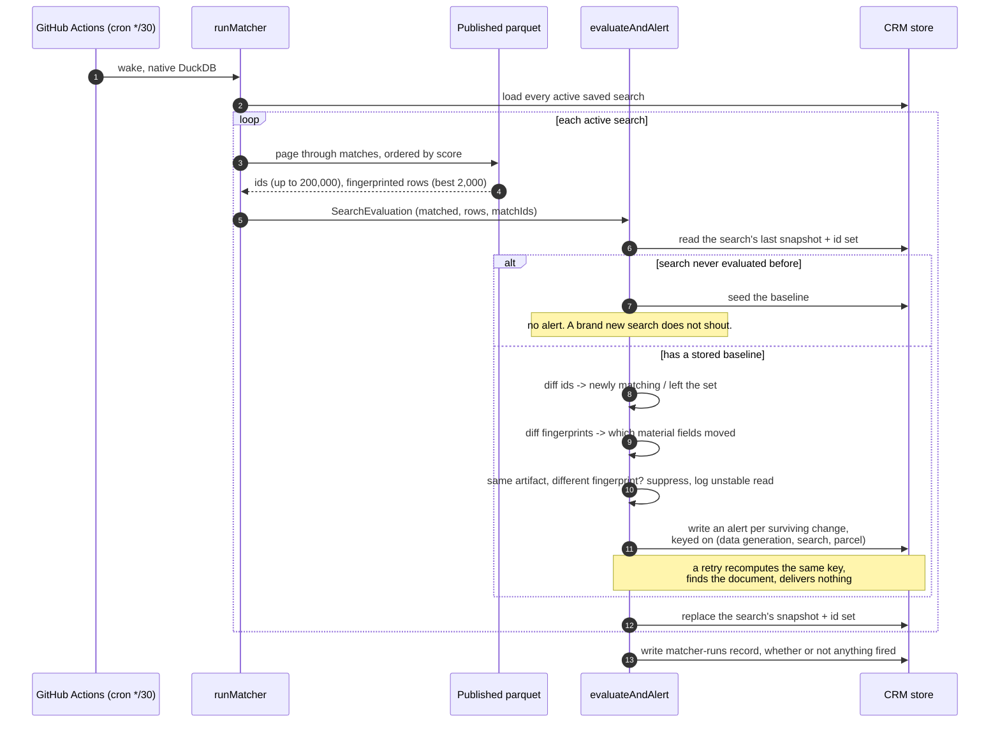
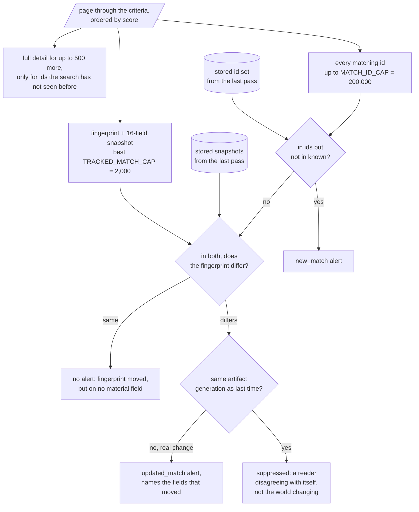
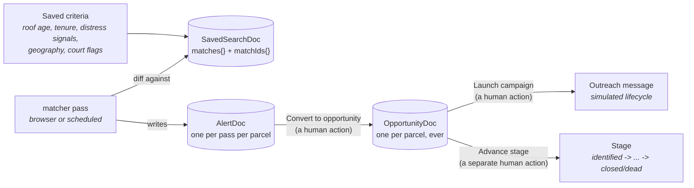
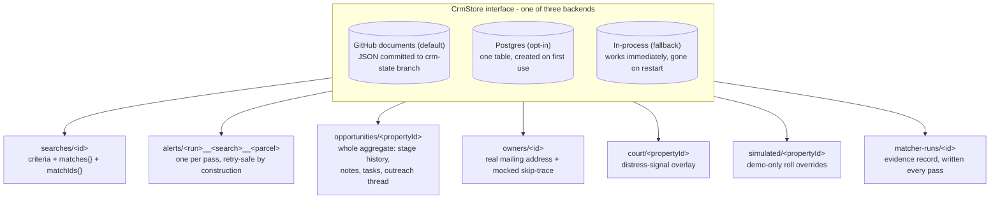
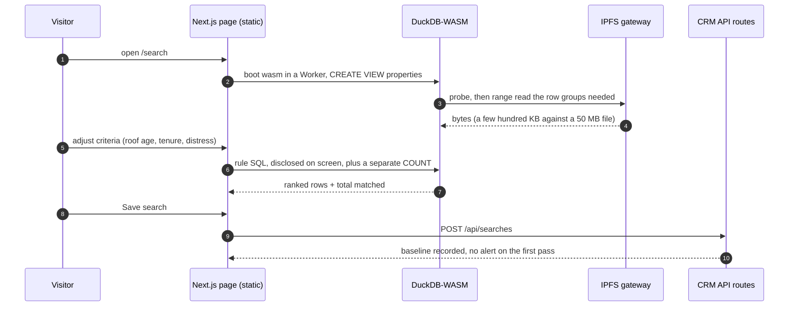
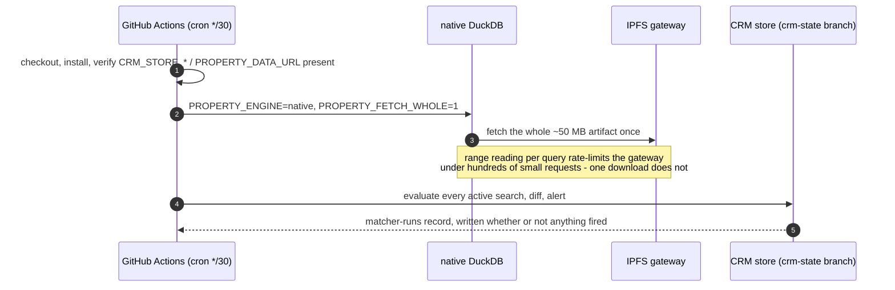
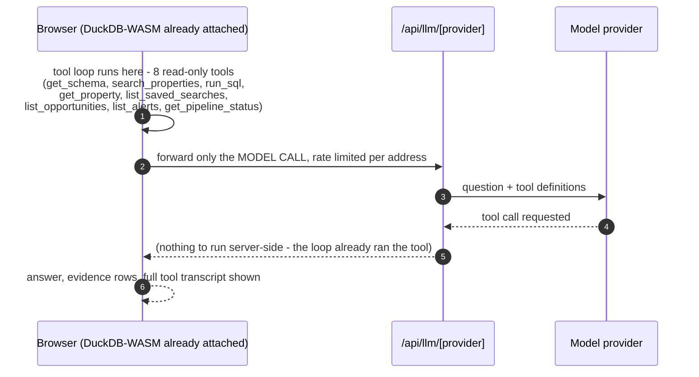
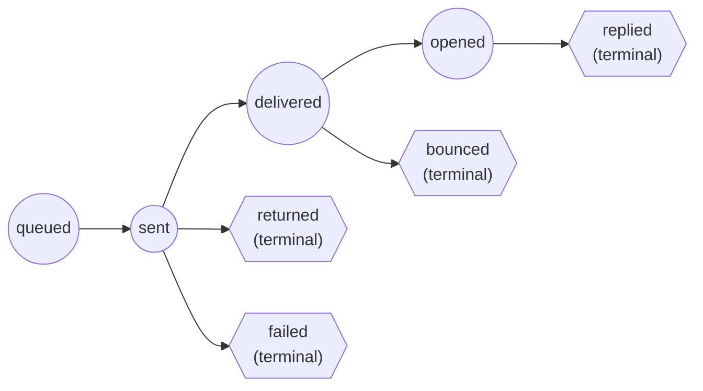

# Architecture

A CRM with no database. It watches a county property dataset it does not own, on a schedule it does
not control, and remembers what a team decided about a parcel as JSON documents on a git branch.
Every 30 minutes something asks "did anything just start matching," and every time the answer is no,
that is written down too.

| | |
|---|---|
| Parcels consumed | 404,023, read-only, never copied into this application's own store |
| Data source | Published Duval Oracle query table, parquet on IPFS/Filebase, 133 columns |
| Query engines | DuckDB-WASM (browser), native DuckDB or WASM-node (scheduled matcher, agent) |
| Continuous half | GitHub Actions, every 30 minutes, diffs against the last stored snapshot |
| CRM store | JSON documents, default: a git branch. Swappable to Postgres or in-process |
| Membership cap / fingerprint cap | 200,000 ids per search / 2,000 fully diffed fields |
| Outreach | Simulated: 3 channels, 8 statuses, addressed to reserved `.invalid` / 555 destinations |
| Runtime cost when idle | none: no server, no database, no standing compute |

Diagrams follow the **C4 model** (context, then containers), drawn as Mermaid flowcharts rather than
`C4Context` blocks for the same reason the sibling pipeline repository gives: reliable layout on
GitHub. Node shape carries the C4 role: rounded is a person, a plain box is something built here, a
cylinder is a data store, and a double-edged box is a system outside this application's control.

---

## 1. Context - C4 Level 1



One person, four outside dependencies, and three of them cost nothing per use. Only the model
provider is metered, and only when the agent is actually asked something.

---

## 2. Containers - C4 Level 2

The pipeline is somebody else's writer. This application never writes to the parquet, and the
parquet's owner never writes to this application's store.



| Container | Built with | Responsibility |
|---|---|---|
| Browser (map, search, criteria) | Next.js, DuckDB-WASM | Runs SQL in the visitor's own tab against the published parquet; posts what it found to the CRM routes |
| Scheduled matcher | GitHub Actions, native DuckDB | Wakes every 30 minutes, evaluates every active saved search against the current artifact, diffs, alerts |
| CRM API routes | Next.js route handlers, Vercel serverless | Saved searches, opportunities, alerts, outreach, simulation - all through one `CrmStore` interface |
| CRM store | GitHub Contents API (default), Neon Postgres, or in-process | Saved criteria, match history, alerts, deals, notes, tasks, outreach, overlay - never the parcels |
| Agent route | Vercel AI SDK, `/api/llm/<provider>` proxy | Forwards a model call on the deployment's own key; the tool loop and the data it reads never leave the tab |

---

## 3. One matcher pass, stage by stage

Two callers run the identical decision logic: the browser posts what DuckDB-WASM found, and the
scheduled runner does the same with native DuckDB. Neither owns a second implementation of what
counts as new, changed, or worth suppressing - both hand their result to `evaluateAndAlert`.



That last write matters as much as any alert: a pass that finds nothing writes down that it looked,
which is what lets "nothing arrived since the last check" be an answer instead of a silence.

---

## 4. The core mechanism - two caps, because membership and change cost differently

This is the part a database schema would not need and a git-committed JSON document does: an id is
eleven bytes, a fingerprint plus a sixteen-field snapshot is about a kilobyte, so "is this parcel in
the set" and "what does this parcel look like" are capped separately rather than sharing one number.



The `samegen` guard exists because it fired for real: a gateway resolved one IPNS name to two
different pinned generations of the artifact, and four consecutive passes alerted on the same 23
parcels as a field flickered between a value and null with nothing having actually changed on the
roll. Comparing two reads of the *same* published generation and believing the difference is the
exact failure this guard closes; comparing across generations is the feature.

---

## 5. Data flow - criteria to a worked deal



Two edges into `opp` and one into `stage` are deliberately **not automatic**. Converting an alert to
an opportunity, launching outreach, and moving the stage are three distinct decisions an analyst
makes - sending a campaign does not itself advance the stage, because the outcome of the campaign is
exactly what should decide that, not the act of sending it.

---

## 6. The CRM store - one document per aggregate, no join to get wrong



The document id carries an invariant a relational schema would spend a unique index on:
`opportunities/<propertyId>` makes "one live deal per parcel" structural rather than enforced;
`alerts/<run>__<search>__<parcel>` makes a retried matcher pass a no-op rather than a duplicate
notification, because it recomputes the same key and finds the document already there.

The default backend writes through the GitHub Contents API rather than a database: an unchanged
document is never re-written (so a steady-state 30-minute pass that finds nothing produces no commit
at all), a conflicting write re-reads and re-applies the mutation rather than clobbering it, and reads
revalidate against the branch (a conditional request GitHub answers `304` for free) so a write on one
serverless instance is visible to a read on another within one round trip.

---

## 7. Read path A - the browser (map, search, criteria)



No server is in the query path. The count shown is a separate statement built from the same predicate
as the row query, so the headline number can never disagree with the rows beneath it - the same
discipline the sibling pipeline repository applies to its own six questions.

---

## 8. Read path B - the scheduled matcher



The scheduled pass exists because nothing else in this application is awake between requests: parcel
queries run in the visitor's browser and the API is stateless serverless functions. Vercel's Hobby
plan allows one platform-cron invocation a day, which is not a notification service, so the schedule
lives in GitHub Actions instead, where minutes are free on a public repository.

---

## 9. Read path C - the agent



The key never reaches the tab and the data never reaches the server: `/api/llm/<provider>` is a thin
proxy that attaches this deployment's key to a model call and nothing else, so a public, login-free
`/agent` page costs its operator per question rather than per key handed out. Naming a provider with
no key configured is a build-time misconfiguration, not a silent fallback - see the vendored
`lib/oracle/agent/providers.ts` finding recorded in the PR body for the one place this discipline
slipped in the sibling repository.

---

## 10. The outreach lifecycle - simulated, not special-cased



A send mints a `providerMessageId` and receives its whole event timeline **up front**, each event
stamped with the wall-clock time it becomes due - email in 20-240 seconds, SMS in 10-90 seconds,
direct mail in 3-9 days - and `advanceOutreach` applies whatever has come due whenever an opportunity
is read, whenever the matcher runs, or when `Fast forward lifecycle` pulls the whole schedule to now.
`supersedes()` enforces that a terminal status cannot be walked backwards and a redelivered event is a
no-op, so replaying the same event twice changes nothing. Only direct mail's multi-day delay is
guaranteed to still be pending by the time anyone looks at it; email and SMS routinely resolve
themselves within minutes of being sent.

---

## 11. What is real, and what is mocked

| Real | Mocked, because the story says so |
|---|---|
| 404,023 Duval parcels, every value and its provenance | Owner outreach: addressed to a reserved `.invalid` domain and a 555 number |
| Criteria matching, scoring, ranking, the disclosed SQL | Owner contact details: a deterministic mocked skip trace, never a real vendor |
| Change detection: a diff against a real stored snapshot | The delivery lifecycle: a deterministic simulator, not a real Twilio/SendGrid/print vendor |
| The scheduled matcher: a real GitHub Actions cron, a real diff | The "simulate a pipeline update" button: writes a real overlay row the matcher then finds by diffing - the notification is not injected |
| Alerts, opportunities, notes, tasks, stage history | Court data volume: a small demo overlay, not a live county-records feed |

---

## 12. Repository map

```
app/
  search/               map, criteria panel, disclosed SQL, parcel drawer
  searches/             saved searches, watch state, simulate buttons
  alerts/               notification history, evidence per alert
  opportunities/        board + table, filters, export, campaign launch
  opportunities/[id]/   deal detail: stage, notes, tasks, outreach panel
  pipeline/             pipeline run history + matcher run history, clear simulation
  agent/                natural-language search, model dropdown, tool transcript
  api/                  one route per CRM aggregate; see the container diagram
lib/
  data/                 PropertyDataSource: browser (DuckDB-WASM) and server (native/WASM) engines
  criteria/              SQL builder, scoring, fingerprinting (matchHashOf, changedFields)
  notify/                the matcher: evaluate.ts (shared diff), matcher.ts (Node side),
                         collect.ts (the one sweep both matchers use), providers.ts + outreach.ts
                         (the simulated send/lifecycle), limits.ts (the two caps, one place)
  crm/                   documents.ts (shapes), store.ts + store-github.ts / store-postgres.ts /
                         store-memory.ts (the three backends), repo.ts, overlay.ts, simulate.ts
  agent/                 provider registry, the 8-tool read-only agent, rate limiting
  oracle/                vendored from the Duval pipeline repository - see lib/oracle/VENDORED.md
scripts/
  run-matcher.ts         what .github/workflows/matcher.yml actually runs
  verify-loop.ts          the whole notification loop, end to end, against whatever store is configured
  smoke.mts               drives the deployed URL with a real browser
.github/workflows/
  matcher.yml             the continuous half: cron */30, native DuckDB, writes to the CRM store
  ci.yml                  typecheck, lint, test on every push
```

Live system: <https://residential-jax-crm.vercel.app>
